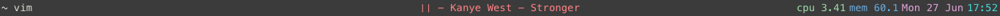

       .aMMMMP .aMMMb  .aMMMb  dMMMMb  dMMMMb  .aMMMb  dMMMMb 
      dMP"    dMP"dMP dMP"dMP dMP VMP dMP"dMP dMP"dMP dMP.dMP 
     dMP MMP"dMP dMP dMP dMP dMP dMP dMMMMK" dMMMMMP dMMMMK"  
    dMP.dMP dMP.aMP dMP.aMP dMP.aMP dMP.aMF dMP dMP dMP"AMF   
    VMMMP"  VMMMP"  VMMMP" dMMMMP" dMMMMP" dMP dMP dMP dMP    
                                                              

## A customizable status bar for macOS.

### A What?

goodbar is a customizable bar for macOS. It lets you put custom scripts in a status bar at the top of the screen.

For example, you can get something awesome like this:

with a simple `.goodbar` config file.

### How do I get it?

Grab the newest release from the [releases page](https://github.com/peterhajas/goodbar/releases). Note that goodbar is prerelease software.

### How do I use it?

goodbar will look for a `.goodbar` file in `~` to populate your bar.

`.goodbar` is written in `JSON`. Here's an example `.goodbar` file:

    {
        "backgroundColor" : "2d2d2d",
        "left" : [
            {
            "script" : "~/bin/status/status_frontmost_window",
             "color" : "#d3d0c8"
            }
        ],
        "center" : [
            {
            "script" : "~/bin/status/status_music",
             "color" : "#f2777a"
            }
        ],
        "right" : [
            {
            "script" : "~/bin/status/status_time",
             "color" : "#66cccc"
            }
        ]
    }

There are three segments: `left`, `center` and `right`. Each segment is an array of items, which are dictionaries which have the `script` and `color` keys. If a color is not provided, orange will be used (a very sane default).

Additionally, there are global values for the entire bar. Currently only the `backgroundColor` and `height` globals are implemented.

Colors can be specified with the standard CSS syntax:

`#ffccaa`

or the abbreviated:

`#fca`

### Contributing?

Check out the source, write some changes, submit a pull request.

### License?

See `license.md`.
